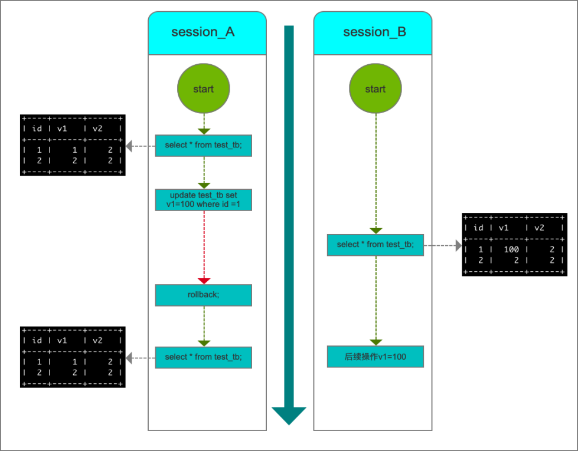

# 事务隔离级别

为了解决"隔离"于"并发"的矛盾，ISO/ANSI SQL92定义了四个事务隔离级别，每个级别的隔离程度不同，而允许出现的副作用也不同，所以不同的业务应该实现灵活的自我选择。

表Ext-1 4中隔离级别的比较

| 隔离级别 | 数据一致性（更新丢失）          | 脏读  | 不可重复读 | 幻读  |
| ---- | -------------------- | --- | ----- | --- |
| 读未提交 | 最低级别，只能保证不读取物理上损坏的数据 | 是   | 是     | 是   |
| 读以提交 | 语句级别                 | 否   | 是     | 是   |
| 可重复读 | 事务级                  | 否   | 否     | 是   |
| 可序列化 | 最高级别，事务级别            | 否   | 否     | 否   |

上述的四个隔离级别只是在标准中定义的四个级别，各个数据库并不是都实现了这四个级别。

## 获取InnoDB行锁征用的情况

可以通过检查InnoDB_row_lock状态变量来分析系统上行锁的争夺情况

`show status like 'innodb_row_lock%';`

```
    +-------------------------------+-------+
    | Variable_name                 | Value |
    +-------------------------------+-------+
    | Innodb_row_lock_current_waits | 0     |
    | Innodb_row_lock_time          | 0     |
    | Innodb_row_lock_time_avg      | 0     |
    | Innodb_row_lock_time_max      | 0     |
    | Innodb_row_lock_waits         | 0     |
    +-------------------------------+-------+
```

> `Innodb_row_lock_current_waits`       :表示当前正在等待锁的数量
> 
> `Innodb_row_lock_time`                :从系统启动到现在总的锁定时间
> 
> `Innodb_row_lock_time_avg`            :平均等待锁的时常
> 
> `Innodb_row_lock_time_max`            :从系统启动到现在最长的一次等待锁的时常
> 
> `Innodb_row_lock_waits`               :从系统启动到现在等待的次数

可以通过InnoDB Monitors 来进一步观察发生的锁冲突的表，数据行等，并分析锁争用的原因：

`CREATE TABLE innodb_monitor(a INT)
    ENGINE=INNODB;`   

然后使用下面的语句来查看：

`Show innodb status\G;`

在分析结束需要删除监控表：

`DROP TABLE innodb_monitor;`

InnoDB实现了以下两类型的行锁：

* 共享锁(S)：允许一个事务去读一行，阻止其他事务获得相同数据集的排他锁
* 排他锁(X): 允许获得排他锁的事务更新数据，阻止其他事务获得相同数据集的共享锁和排他锁

另外，为了允许行锁和表锁共存，实现多粒度锁机制，InnoDB还实现了两种内部使用的[意向锁](../MySql原理/Ext3:InnoDB中的意向锁.md)，这两种意向锁都是表锁：

* 意向共享锁(IS):如果事务打算给数据行添加共享锁，其必须先获得该表的IS锁
* 意向排他锁(IX):如果事务打算给数据行添加排他锁，其必须先获得该表的IX锁

表Ext-2 InnoDB行锁模式兼容性列表

| 当前锁模式\请求锁模式 | X   | IX  | S   | IS  |
| ----------- | --- | --- | --- | --- |
| X           | 冲突  | 冲突  | 冲突  | 冲突  |
| IX          | 冲突  | 兼容  | 冲突  | 兼容  |
| S           | 冲突  | 冲突  | 兼容  | 兼容  |
| IS          | 冲突  | 兼容  | 兼容  | 兼容  |

如果一个事务请求的锁模式与当前兼容，InnoDB就会将请求授予该事务，反之，如果两者不兼容，则需要等待锁释放。

意向锁是InnoDB自动添加的，对于`upddate`,`delete`,`insert`语句，InnoDB会自动给涉及数据集加排他锁(X);对于`select`语句，InnoDB不会添加任何锁，事务可以通过下列语句显示给记录集添加共享锁或者排他锁。

* 共享锁(S): `SELECT * FROM table_name WHERE ... LOCK IN SHARP MODE`;
* 排他锁(X): `SELECT * FROM table_name WHERE ... FOR UPDATE`;

## 四种隔离级别的实现方式

### 读未提交

在MySQL中，实现并发访问数据而不出现并发问题的方法是通过加锁来实现的，而在读未提交事务隔离级别下，MySQL将不会对任何并发操作添加锁。因为没有了加锁带来的性能开销，其效率是最高的，但是在并发事务环境下，该隔离级别对数据安全性毫无保证，在使用的时候需要进行详细的调研测试。

使用指令：

```sql
set global transaction isolation level read uncommitted;
```

设置全局的隔离级别为读未提交，并且设置完成之后需要重新启动session才能生效

由于读未提交隔离级别在事务访问的时候不添加任何锁，那么如果sessionA在进行修改之后，提交之前，session_B读取了session_A刚刚修改的数据是可以读取到的。若此时session_A事务由于提交错误发生了回滚，修改撤销，但是对于session_B而言，读到的就是session_A错误提交的脏数据，也就是发生了所谓的脏读。



### 读已提交

读未提交无法解决脏读的问题，脏读的核心本质是事务能看到其他事务未提交的更改，但是如果我们稍加手段，实现每个事务只能读到其他事务已经提交的数据，那么久解决了脏读的问题，也正是因为如此，读已提交就能够解决脏读的问题。

并且部分DBMS的默认隔离级别就是读已提交，例如oracle，但是mysql并不是这样。

使用指令:

```SQL
set global transaction isolation level read committed;
```

设置全局的隔离界别为读已提交，同样，设置完成之后需要重新启动session才能生效
