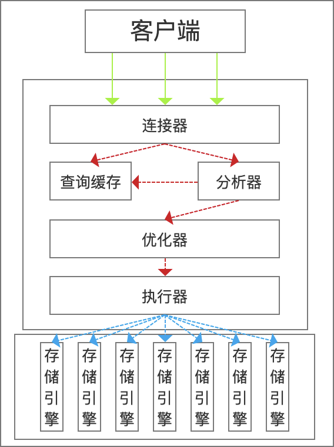

# 1.1MYSQL逻辑架构

最上层的连接器负责管理联结,权限认证,安全等.

下面的分析器由内部构造的语法树对SQL语句进行优化,调整顺序,判断优先查询那个表,以及选择合适的索引等.用户可以通过特殊的关键字来印象优化器的决策,也可以要求优化器解释优化过程的各个因素,使得用户可以得知是如何进行优化的(使用EXPLAIN).

优化器不关心底层使用的是什么存储引擎,但是存储引擎会影响优化器的优化,存储引擎提供相关操作的开销以及表的统计信息.

而且SELECT在查询的时候会首先查询缓存,如果在缓存中直接命中,则会直接返回,

# 1.2 并发控制
MYSQL在两个层面进行并发控制,服务器层和存储引擎层.在并发环境下,如果多个线程同时进行读操作,不会对数据进行修改,那么自然不会出错.但是一旦有线程进行修改操作就会发生异常,那么这时客户端可能就会报错或者读到数据不一致的数据.

## 1.2.1 读写锁
解决这种问题最经典的方法就是进行并发控制,在进行并发读或者写的时候,可以通过实现一个由两种类型的锁组成的锁系统来解决问题.这两种锁通常被称为共享锁和排他锁,也叫读锁和写锁.

**读锁**是共享的, **写锁**是排他的,这是因为出于安全的考量,当一个进程在写的时候,不允许其他进行读操作,在MYSQL中每时每刻都在进行资源的锁,并且大多数时候锁对于业务而言都是透明的.

## 1.2.2 锁粒度
提高共享资源并发性的一种方式就是让锁定的对象更有选择性,在对资源进行加锁的时候,尽量锁定少部分必要的数据,此时其他未被锁定的数据就可以被其他线程进行操作.更理想的方式就是只对需要进行修改的数据进行锁定.任何时候,在给定的资源上,锁定的数据量越少,系统的并发就越高.

而在进行锁的相关操作,也是需要消耗系统资源的,如果系统的锁粒度越细,那么并发程度越高,同一时刻系统要维护的锁的数量就越多,从而系统进行锁维护消耗的资源也就越多,系统的性能很有可能由此受到影响.

而所谓的锁策略,就是在系统在锁维护上操作的性能和整体的数据安全之间寻求平衡,目前大多数商业数据库没有提供更多的选择,一般都是在表上添加行级锁,并且尽可能使用更为节省资源的实现方式以寻求更好的性能.

**表锁**

表锁是MYSQL提供的最基本的锁策略,而且也是开销最小的锁策略.表锁在进行锁定的时候会锁定整张表,那么此时就会阻止其他所有的读写操作.在特定的场景下,表锁也可能有良好的性能,例如READ LOCAL表锁可以支持某种类型的并发写操作.另外,写锁也比读锁有着更高的优先级,这就导致写锁可能就插入到读锁之前.

尽管存储引擎可以管理自己的锁,MYSQL也就强制使用表锁来达到某种目的从而忽略存储引擎的锁机制.

**行级锁**

行级锁可以最大程度的支持并发,但是行级锁会消耗更多的资源.在InnDB引擎和XtraDB中,都实现了行级锁,但是在MYSQL的服务层中,则没有实现,服务层完全不了解存储引擎中锁的实现方式.

# 1.3 事务
事务是SQL中一个重要的特性,其核心就是一组SQL执行逻辑,并要求这一组逻辑中的每一条语句都必须执行,如果其中一条没有执行,那么整租SQL执行逻辑就必须全部回滚.

任何一个稳定的事务都必须要实现ACID才能稳定的执行事务逻辑，ACID指的是事务的执行事务数据库的四个特性，原子性，一致性，隔离性，持久性。

**原子性**指的是事务内的SQL执行必须是一个整体，要么全部执行，要么一条都不能执行，对于一个事务而言，不能出现一个事务中的部分SQL执行，另一部分SQL不执行的情况，这就是事务的原子性。

**一致性**指的是数据库必须从一个一致的状态转移到另外一个一致的状态，如果事务中的SQL不能完全执行，那么就会破坏事务的一致性。

**隔离性**指的是一个事务在执行过程中，对于另外一个事务是不可见的，也就是说其他事务不会调用到一个事务执行过程中的中间数据，而要实现事务的隔离性需要依托于事务的隔离级别。

**持久性**指的是事务的运行结果必须要被持久化到硬盘中，不能随着系统断电，关机而丢失。

实现数据库的ACID可以确保事务的可靠执行，但是在具体实现中却非常难，甚至可以说是不可能实现的。类似于锁操作需要消耗而外的系统资源一样，这种保证系统中事务而外的安全性的行为，同样需要消耗大量的资源来实现，一个能够实现ACID的数据库往往比无法实现ACID的数据库有着更好的CPU，内存，硬盘等硬件。所以在实际使用的时候，需要根据实际的业务类型来选择是否需要选择能够实现ACID的数据库。

而即使对于不支持ACID的数据库引擎，同样可以使用`LOCK TABLE`语句来提供一定的保护措施，而这些都可以由用户来选择。

如果事务的ACID特性无法保证，数据库在处理事务的时候就会造成如下问题：更新丢失，脏读，幻读，不可重复读

## 1.3.1 隔离级别

数据库中的隔离性要远远比想的复杂，MYSQL中提供了四种隔离级别，以规定在一个事务中数据，在其他那些事务中是可见的：

**`READ UNCOMMITED`(读未提交):**

