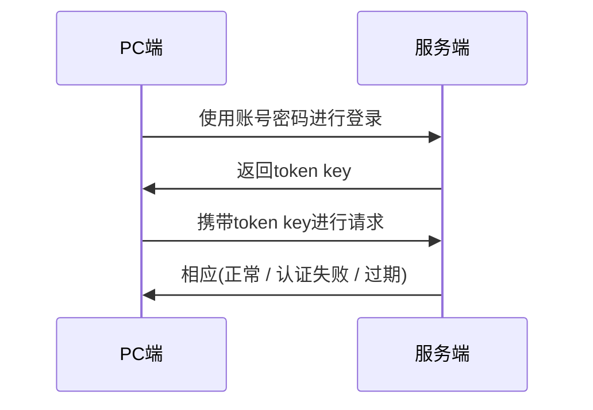

# $\textcolor{purple}{扫码登录分析}$

在扫码登录过程中涉及**三个角色**以及**两个问题**

## $\textcolor{purple}{扫码登录三种角色}$

在扫码登录过程中,涉及的三个角色 : PC页面端,手机端,服务端

在设计过程中主要围绕这三个端来展开,具体的设计其实就是每个端完成什么样的功能,应该如何实现,如何交互

## $\textcolor{purple}{两个问题}$

扫码登录实际上是一种特殊的登录验证方式,核心面临的是两个问题:

* 手机端如何完成验证
* PC端如何完成验证

## $\textcolor{purple}{普通PC端登录验证流程}$



普通的PC页面登录流程中,PC端向后端发送账号密码完成验证,然后由服务器同步返回token和key之类的标识,而PC后续请求服务端的时候,需要携带该token,服务端接收后会对该token进行验证来确保登录状态.

当场景换到扫码登录的时候,那么认证阶段就不再是通过PC端提交账号密码进行验证,而是手机端通过扫码来进行验证

PC不在提交账号密码之后就无法同步获取认证成功之后的token信息,那么就必须提供某种机制保证PC端获取认证的凭证

# $\textcolor{purple}{扫码登录实现}$

## $\textcolor{purple}{手机端如何实现认证}$

### $\textcolor{purple}{二维码生成}$

二维码是在PC端进行展示,所以这个阶段主要为PC端请求服务器,获取相应的数据,然后再由PC端生成二维码

### $\textcolor{purple}{二维码内容}$

二维码是在这个场景中一个重要的媒介,要保证唯一性,服务端必须给这个数据生成唯一的标识作为二维码ID,同时还应该设置过期时间,PC根据二维码ID及相关数据生成二维码ID

```sequence
PC端 -> 服务端 : 发送请求,申请二维码ID
服务端 -> 服务端 : 生成唯一的二维码ID,存储,并设置过期时间
服务端 -> PC端 : 返回二维码ID
PC端->PC端 : 结合二维码ID等信息生成二维码
```

在上述流程中,服务端还要同时保存二维码的相关状态信息 :  $\textcolor{purple}{未扫描}$,$\textcolor{purple}{以成功}$,$\textcolor{purple}{以失效}$

### $\textcolor{purple}{APP端认证机制}$

在APP中,手机端一般是不会存储登录的账号和密码,在安装APP之后,只有在第一次登录的时候才需要提供账号密码进行登录,而在后续,关闭APP甚至是关机重启之后,都是不需要在使用账号密码进行登录,其可以实现自动登录

这背后的一整套token验证机制,和PC有点像,但是又不是完全相同

```sequence
手机端 -> 服务端 : 账号密码和设备信息
服务端 -> 手机端 : 返回token key
手机端 -> 服务端 : 携带token key和设备信息请求
服务端 -> 服务端 : 校验token
服务端 -> 手机端 : 相应(正常/认证失败)
```

* APP登录过程中,进行认证的数据不仅仅是账号密码,还有手机的设备信息
* 账号密码校验通过之后,服务端会把账号和设备进行绑定,进行持久化的存储,包含了账号ID,设备ID,设备类型等.
* APP每次请求除了携带token key以外,还需携带设备信息

因为移动设备端的设备具有唯一性,可以为每个客户端生成专属的token,这个token也不需要设置过期时间,这就是APP可以实现一次登录,长久使用的原理

### $\textcolor{purple}{手机扫码干了什么}$

* **$\textcolor{purple}{扫描二维码}$** : 识别PC端展示的二维码,获取二维码ID

  ```sequence
  手机端 -> PC端 : 扫描二维码
  PC端 -> 手机端 : 返回二维码ID
  ```
* $\textcolor{purple}{确认登录}$ : 手机端通过携带认证信息(token key,设备ID),二维码信息(二维码ID)请求服务端,完成认证过程,确认PC端的登录

  ```sequence
  手机端 -> 服务端 : 携带token key,设备信息,二维码信息
  服务端 -> 服务端 : 校验token,确认PC端登录
  服务端 -> 手机端 : 相应(正常/失败)
  ```

  > 关于手机扫码和确认,不是重点,一种说法是扫码的同时想服务端申请一次临时性的token,确认登录的时候携带这个临时token来访问服务端
  >

## $\textcolor{purple}{PC端如何完成登录}$

在手机端完成登录之后,服务端是通过获取二维码的状态信息来确定登录的状态,并作出相关的相应

* 二维码$\textcolor{purple}{未扫描} : 无操作$
* 二维码$\textcolor{purple}{已失效}$ : 提示刷新二维码
* 二维码$\textcolor{purple}{已成功}$ : 从服务端获取PC token

而获取二维码的状态,主要有三种方式

### $\textcolor{purple}{轮询}$

轮询是PC端每隔一段时间就主动给服务端发送一次二维码的状态的查询请求

```sequence
PC端 -> 服务端 : 携带二维码ID请求二维码状态
服务端 -> 服务端 : 未扫描
服务端 -> PC端 : 返回未扫描
PC端 -> 服务端 : 携带二维码ID请求二维码状态
服务端 -> 服务端 : 未扫描
服务端 -> PC端 : 返回未扫描
PC端 -> 服务端 : 携带二维码ID请求二维码状态
服务端 -> 服务端 : 以成功
服务端 -> PC端 : 返回pc token key
```

### $\textcolor{purple}{长轮询}$

长轮询指的是客户端会主动不间断的给服务端发送查询请求,服务端接收到请求之后,如果二维码信息没有发生更新,服务端会对请求进行阻塞直到超时,若二维码仍然没有被扫描,则会就行发送查询请求,直到状态发生变化(已失效或者已成功)

```sequence
PC端 -> 服务端 : 携带二维码ID请求二维码状态 
服务端 -> 服务端 : 阻塞直到状态发生改变或者超时
服务端 -> PC端 : 返回token key
```

### $\textcolor{purple}{websocket}$

Websocket指的是前端生成二维码之后,会与后端建立链接,一旦后端发现二维码状态发生变化,可以直接建立链接主动向PC端推送消息

```
PC端 --> 服务端 : 建立webSocket
服务端 --> 服务端 : 当状态发生改变
服务端 --> PC端 : 推送pc token key
```

## $\textcolor{purple}{总结}$

```sequence
PC端 -> 服务端 : 访问扫描登页面,获取二维码ID
服务端 -> 服务端 : 服务端生成二维码ID,保存过期时间,状态
服务端 -> PC端 : 返回二维码ID
PC端 -> PC端 : 根据二维码ID生成二维码
PC端 --> 服务端 : 轮询获取二维码状态
服务端 --> PC端 : 二维码状态失效
PC端 -->PC端 : 二维码失效提示用户更新
手机端 -> PC端 : 扫描二维码,获取二维码ID
手机端 -> 服务端 : 将二维码ID和token发送给服务端,确认登录
服务端 -> 服务端 : 校验手机端token和二维码ID,如果合法生成PC端token
PC端 -> 服务端 : 获取PC token 登录成功
```

> 流程总结
>
> * 访问PC端二维码生成页面,PC端请求服务端获取二维码ID
> * 服务端生成相应的二维码ID,设置二维码的过期时间,状态等
> * PC获取二维码ID,生成相应的二维码
> * 手机端扫描二维码,获取二维码ID
> * 手机端将二维码ID和手机token发送给服务端,确认登录
> * 服务端校验手机端token,根据手机端token和二维码ID生成PC端token
> * PC 端通过轮询方式请求服务端,通过二维码ID获取二维码状态,如果已经成功,返回PC token登录成功
