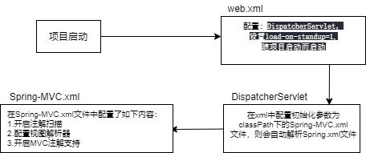
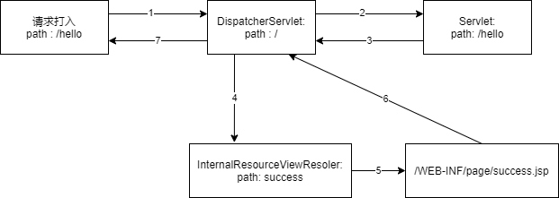

# Spring MVC 的基本概念

* 三层架构
* MVC

## 三层架构

正常的开发都是基于两种架构的，C/S架构和B/S架构，C/S架构成为客户端浏览器架构，这种类型架构的程序用户体验好，可以针对于客户端进行深度的定制，界面美观，但是成本较高，需要同时维护客户端和服务端双端。而B/S架构称为浏览器服务器架构，基于该架构的程序也可以理解为一种特殊的C/S架构程序，只不过这里的C客户端值得是浏览器，而程序只是浏览器中的数据流，这种架构的优点是用户在使用的时候不需要下载额外的客户端就能使用，并且如果软件更新，用户也不需要重新下载客户端，但是这种方式有一个限制就是其能提供的服务会受制于浏览器提供的接口功能，但是在维护的时候只需要维护服务器端就可以，能够减少开发成本。

在常见的开发环境中，基于B/S架构的程序非常多，在B/S架构中也可以抽象出三层架构：也就是表现层，业务层，持久层。

### 表现层

表现层就是常说的web层，其主要的功能就是进行页面的展示和请求的接受和解析。

表现层通常包含展示层和控制层，控制层用于请求的接受，而展示层用于数据对象的转化和解析。

表现层通常使用MVC结构来实现

### 业务层

业务层就是常说的服务层，他负责处理逻辑业务，表现层是严重依赖业务层的，但是业务层并不会严重以来表现层。

业务层在处理业务的时候有可能会依赖持久层，并且如果我们需要对数据进行持久化操作需要保持事务一致性，也就是所谓事务控制要放在业务层层来实现。

### 持久层

持久层是数据持久化层，也就是数据存储的位置，该层主要负责数据的CRUD；

## MVC模型

MVC模型的全程是Module View Controller ，也就是模型-视图-控制器：

Module:(模型) 模型通常是针对于实体的封装，也就是数据模型，也是控制器操作的对象
View:(视图) 通常指的是JSP和html.一般就是用于数据展示。
Controller:(控制器) 该层主要是针对VO，QO到DTO之间的数据转换。大部分作为服务端的参数校验，特别要注意，该层不应用来处理业务逻辑，主要的业务逻辑应该下放到业务层来执行，不应该使用控制器来执行业务信息。

## SpringMVC 具体案例实现

* 首先使用maven骨架创建Webapp项目，随后补全下项目路径。

* 导入依赖jar包
  
  ```xml
    <dependency>
      <groupId>org.springframework</groupId>
      <artifactId>spring-context</artifactId>
      <version>${spring.version}</version>
    </dependency>
  
    <dependency>
      <groupId>org.springframework</groupId>
      <artifactId>spring-web</artifactId>
      <version>${spring.version}</version>
    </dependency>
  
    <dependency>
      <groupId>org.springframework</groupId>
      <artifactId>spring-webmvc</artifactId>
      <version>${spring.version}</version>
    </dependency>
  ```

* 导入相关maven坐标依赖之后，需要配置web.xml文件，设置全局servler监听类为Spring-MVC 提供的DispatcherServlet，路径为全局路径，并且设置初始化参数contextConfigLocation为classpath:springMvc.xml文件名称用于初始化Spring-MVC配置内容

* 在SpringMvc.xml中需要开启全局注解扫描，并且设置试图解析器Bean对象，指定前缀和后缀属性，前缀应该是jsp页面所处于的位置，而后缀应该是JSP配置文件的文件名。

* 随后创建Controller，使用@Controller注解来标志当前类是一个Controller类，使用@RequestMapping注解指定当前函数是控制器函数，返回类型为String用于拼接最后的返回结果

> JAVA controller类实例

```JAVA
package cn.net.astoria.controller;


import org.springframework.stereotype.Controller;
import org.springframework.web.bind.annotation.RequestMapping;

@Controller
public class FirstPageController {

    static{
        System.out.println("the FirstController is init");
    }

    @RequestMapping(path = "hello")
    public String testInterface(){
        System.out.println("this is test interface");
        return "success";
    }
}
```

> spring-mvc.xml配置文件实例

```XML
<?xml version="1.0" encoding="UTF-8"?>
<beans xmlns="http://www.springframework.org/schema/beans"
       xmlns:xsi="http://www.w3.org/2001/XMLSchema-instance"
       xmlns:context="http://www.springframework.org/schema/context"
       xsi:schemaLocation="http://www.springframework.org/schema/beans http://www.springframework.org/schema/beans/spring-beans.xsd http://www.springframework.org/schema/context http://www.springframework.org/schema/context/spring-context.xsd">

<!--    开启Spring的注解扫描-->
    <context:component-scan base-package="cn.net.astoria.controller"/>

<!--    配置视图解析器-->
    <bean id="viewResolver" class="org.springframework.web.servlet.view.InternalResourceViewResolver">
        <property name="prefix" value="/WEB-INF/page/"/>
        <property name="suffix" value=".jsp"/>
    </bean>
</beans>
```

> Web.xml文件实例

```xml
<!DOCTYPE web-app PUBLIC
 "-//Sun Microsystems, Inc.//DTD Web Application 2.3//EN"
 "http://java.sun.com/dtd/web-app_2_3.dtd" >

<web-app>
  <display-name>Archetype Created Web Application</display-name>

  <servlet>
    <servlet-name>globalDispatcher</servlet-name>
    <servlet-class>org.springframework.web.servlet.DispatcherServlet</servlet-class>
    <init-param>
      <param-name>contextConfigLocation</param-name>
      <param-value>classpath:SpringMVC.xml</param-value>
    </init-param>
    <load-on-startup>1</load-on-startup>
  </servlet>

  <servlet-mapping>
    <servlet-name>globalDispatcher</servlet-name>
    <url-pattern>/</url-pattern>
  </servlet-mapping>

</web-app>
```

> pom文件实例

```XML
<?xml version="1.0" encoding="UTF-8"?>

<project xmlns="http://maven.apache.org/POM/4.0.0" xmlns:xsi="http://www.w3.org/2001/XMLSchema-instance"
  xsi:schemaLocation="http://maven.apache.org/POM/4.0.0 http://maven.apache.org/xsd/maven-4.0.0.xsd">
  <modelVersion>4.0.0</modelVersion>

  <groupId>cn.net.astoria</groupId>
  <artifactId>SpringMVC_p1</artifactId>
  <version>1.0-SNAPSHOT</version>
  <packaging>war</packaging>

  <name>SpringMVC_p1 Maven Webapp</name>

  <properties>
    <project.build.sourceEncoding>UTF-8</project.build.sourceEncoding>
    <maven.compiler.source>1.7</maven.compiler.source>
    <maven.compiler.target>1.7</maven.compiler.target>
    <spring.version>5.0.2.RELEASE</spring.version>
  </properties>

  <dependencies>

    <dependency>
      <groupId>junit</groupId>
      <artifactId>junit</artifactId>
      <version>4.11</version>
      <scope>test</scope>
    </dependency>

    <dependency>
      <groupId>com.att.inno</groupId>
      <artifactId>log4j</artifactId>
      <version>1.2.13</version>
    </dependency>

    <dependency>
      <groupId>org.springframework</groupId>
      <artifactId>spring-context</artifactId>
      <version>${spring.version}</version>
    </dependency>

    <dependency>
      <groupId>org.springframework</groupId>
      <artifactId>spring-web</artifactId>
      <version>${spring.version}</version>
    </dependency>

    <dependency>
      <groupId>org.springframework</groupId>
      <artifactId>spring-webmvc</artifactId>
      <version>${spring.version}</version>
    </dependency>

    <dependency>
      <groupId>javax.servlet</groupId>
      <artifactId>servlet-api</artifactId>
      <version>2.3</version>
      <scope>provided</scope>
    </dependency>

    <dependency>
      <groupId>javax.servlet.jsp</groupId>
      <artifactId>jsp-api</artifactId>
      <version>2.0</version>
      <scope>provided</scope>
    </dependency>


  </dependencies>

  <build>
    <finalName>SpringMVC_p1</finalName>
    <pluginManagement><!-- lock down plugins versions to avoid using Maven defaults (may be moved to parent pom) -->
      <plugins>
        <plugin>
          <artifactId>maven-clean-plugin</artifactId>
          <version>3.1.0</version>
        </plugin>
        <!-- see http://maven.apache.org/ref/current/maven-core/default-bindings.html#Plugin_bindings_for_war_packaging -->
        <plugin>
          <artifactId>maven-resources-plugin</artifactId>
          <version>3.0.2</version>
        </plugin>
        <plugin>
          <artifactId>maven-compiler-plugin</artifactId>
          <version>3.8.0</version>
        </plugin>
        <plugin>
          <artifactId>maven-surefire-plugin</artifactId>
          <version>2.22.1</version>
        </plugin>
        <plugin>
          <artifactId>maven-war-plugin</artifactId>
          <version>3.2.2</version>
        </plugin>
        <plugin>
          <artifactId>maven-install-plugin</artifactId>
          <version>2.5.2</version>
        </plugin>
        <plugin>
          <artifactId>maven-deploy-plugin</artifactId>
          <version>2.8.2</version>
        </plugin>
      </plugins>
    </pluginManagement>
  </build>
</project>
```

## Spring-MVC项目启动流程总结

### 项目启动流程

Service端项目启动过程中调用链关系如下：

* 首先tomcat服务器会加载项目下的web.xml文件，在web.xml文件中配置了DispatcherServlet视图解析器，则会加载Dispatcher视图解析器。

* 在DispatcherServlet视图解析器中配置了SpringMVC.xml文件路径，会自动加载SpringMVC.xml路径下的文件，并且读取SpringMVC.xml中的配置信息



### 请求打入流程

当请求打入时候，首先回去调用DispatcherServlet，DispatcherServlet接收到请求之后，会按照路径调用对应的servlet执行请求内容，当请求内容执行完成之后，Servlet返回结果给DispatcherServlet,Dispatcher在去请求视图解析器，视图解析器随后拼接page对象返回给DIspahtcherServlet，DispatcherServlet最后将页面返回。



### 请求打入完整流程


### 前端控制器：`DispatcherServlet`

> 用户请求到达前端控制器，相当于MVC模式中的C，dispatcherServlet是整个流程控制的中心，由他调用其他组件处理用户的请求，dispatcherServlet的存在降低了组件之间的耦合

### 处理器映射器 ：`HandlerMapping`

> HandlerMapping负责根据用户请求找到Handler即处理器，SpringMVC提供了不同的映射器实现不同的映射方式，例如：配置文件方式，接口实现方式，注解方式等。

### 处理器 ：`Handler`

> 处理器就是业务中需要编写的具体业务的控制器。由DispatcherServlet将用户的请求转发到Handler。由Hanlder对具体的用户请求进行处理。

### 处理器适配器 ： `HandlerAdapter`

> 通过HandlerAdapter对处理器进行执行，这是适配器模式的应用，通过扩展适配器可以对更多类型的处理器进行执行。

### 视图解析器 ： `View Resoler`

> View Resoler负责将处理结果生成View视图，ViewResoler首先根据逻辑视图名解析成物理的视图名，即具体的页面地址，再生成View对象，最后对View进行渲染将处理结果通过页面展示给用户。

### 视图 ： `View`

> SpringMVC框架提供了很多View视图的支持，包括jstlView ， freemarkerView ， pdfView等，
> 
> 一般情况下需要通过页面标签或者页面模板技术将模型数据通过页面展示给用户，需要根据具体的业务需求开发具体的页面

### `<mvc:annotation-driven>`说明

> 在SpringMVC的各个组件中，处理器映射器，处理器适配器，视图解析器称为SpringMVC的三大组件。
> 
> 使用\<mvc:annotation-driven>自动加载`RequestMappingHanlerMapping`（处理器映射器）和`RequestMappingHandlerAdapter`（处理器适配器）,可以在SpringMVC.xml文件中使用`<mvc:annotation-driven>`注解替代映射器和适配器的配置。

## `RequestMapping`注解的作用

> 用于建立请求URL和处理方法之前的映射关系，
> 
> 可以作用于方法或者类，接口上面，在请求的时候，会默认拼接类上的`RequestMapping`的Value值和方法上的`RequestMapping`的Value值。
> 
> 属性：
> 
> * value  : 用于指定访问的URL，该属性和path完全一样
> 
> * path : 用于指定访问的URL，该属性和value完全一样。
> 
> * method : 用于指定请求的方法
> 
> * params : 用于限制请求的参数
> 
> * headers : 用于限制请求的消息头
